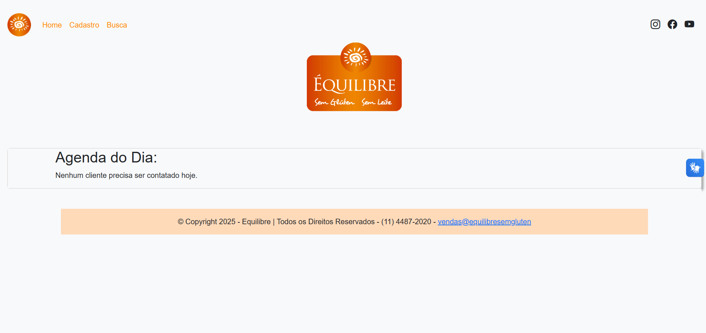
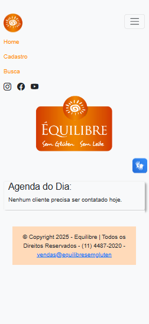

## **:cookie: Equilibre Sem Glúten - Prospecção :bread:**


### :bulb: **Sobre o **Equilibre - Prospecção**:**

O **Equilibre - Prospecção** é uma ferramenta de CRM(Customer Relationship Management), o qual tem como principal objetivo, realizar o registro e a gestão de prospecção de novos clientes. 

Como cenário, foi realizado o estudo e a parametrização das soluções na empresa, **Equilibre Sem Glúten**, empresa especialista em prover produtos naturais e especiais não perecíveis.

Onde sua principal "dor", era a necessidade de centralização de informações de prospecção de novos clientes, mediante uma ferramenta moderna, de fácil acesso, que substituísse o uso de planilhas e que provê informações de forma uniforme e em tempo real. 

&nbsp;




&nbsp;


### :link: Projeto Integrador II - Website

Link do projeto consolidado na Web: [Equilibre - Prospecção](#)


&nbsp;

### :movie_camera: Projeto Integrador II - Youtube

Link do projeto consolidado e da apresentação no: [Youtube](#)


&nbsp;


### 📋 **Pré-requisitos**

Antes de começar, você vai precisar ter instalado em sua máquina as seguintes ferramentas:


-  [Python](https://www.python.org/downloads/);
-  [VSCode](https://code.visualstudio.com/);
-  [Django](https://www.djangoproject.com/download/);
-  [Git Bash](https://git-scm.com);
-  Possuir uma conta no [Github](https://github.com/).

&nbsp;


### 🛠️ Construído com:

Ferramentas utilizadas para a contrução do projeto:

**Frontend**

* [CSS](https://www.w3schools.com/css/)
* [Bootstrap](https://getbootstrap.com/)
* [HTML](https://www.youtube.com/playlist?list=PL39zbyHjgjrbsP3xFSc-YH-6FN8WNpglh) 
* [JavaScript](https://www.w3schools.com/js/js_examples.asp)


**Backend**

* [Django](https://www.w3schools.com/css/)
* [Python](https://getbootstrap.com/)


**Testes**

* [Pytest](https://pytest-django.readthedocs.io/en/latest/)


**Serviço de Cloud**

* [Render](https://www.w3schools.com/css/)


**Banco de Dados**

* [Railway](https://railway.app/)
* [Postgres](https://www.postgresql.org/)


**Container**

* [Docker](https://www.docker.com/)


**APIs**

* [insomnia REST](https://insomnia.rest/download)


**Ambientes**

* [venv](https://dev.to/franciscojdsjr/guia-completo-para-usar-o-virtual-environment-venv-no-python-57bo)

**Recursos Adicionais**

* Biblioteca do Django,Python e recursos de IA(Github Copilot)

&nbsp;

### ⌨️ Executando a aplicação Localmente

Abra o terminal e digite o seguinte comando:

```
python manage.py runserver

```

> A aplicação irá rodar através do endereço local: ***http://127.0.0.1:8000/***


&nbsp;

### 🎲 Acessibilidade:

- **Libras**

[VLibras](https://www.gov.br/governodigital/pt-br/acessibilidade-e-usuario/vlibras): Objetivo: Tornar computadores, celulares e plataformas Web mais acessíveis para as pessoas surdas.

&nbsp;

- **Responsividade**



&nbsp;


### 👨‍💻 **Contribuidores**:

Relação das desenvolvedoras que contribuíram para a reaização deste projeto. 👏

|**Alunas**|
|----|
|[Thais Faustino](https://github.com/thaiisfaustino)| 
|[Renata Caroline de Oliveira](https://github.com/renataoliveira93)| 
|[Ana Laura Martins Francisco](https://github.com/AnafraUnivesp)| 

&nbsp;


### :hourglass: **Releases Notes:**


|**Informações**| **Descrição** |**Data** | 
|----|-----|-----|
|**Release de Lançamento**| V.0.0 - Versão inicial de lançamento  | Novembro/2024 |

&nbsp;


### :mortar_board: **Informações Acadêmicas:**

Informações acadêmicas do projeto. 


| **Informações** | **Descrição** |
|----|-----|
|**Instituição**| [UNIVESP - Universidade Virtual do Estado de São Paulo](https://univesp.br/) |
|**Disciplina**| Projeto Integrador em Computação II |
|**Cursos**| Engenharia de Computação/Bacharelado em Tecnologia da Informação/Bacharelado em Ciência de Dados|
|**Grupo**| DRP04-PJI240-SALA-001GRUPO-006  |
|**Período**| Segundo Semestre - 2024 |
|**Temática**|Resolução de problemas. Levantamento de requisitos. Desenvolvimento web com framework. HTML. CSS. Linguagem de script. Banco de Dados. Controle de Versão. Nuvem. API. Acessibilidade. Testes. Análise de dados.
|**Objetivos da disciplina** | Desenvolver um software com framework web que utilize banco de dados, inclua script web (Javascript), nuvem, uso de API, acessibilidade, controle de versão e testes. Opcionalmente, incluir análise de dados.|
|**Orientação**| Camila Rodrigues Silva |

&nbsp;


